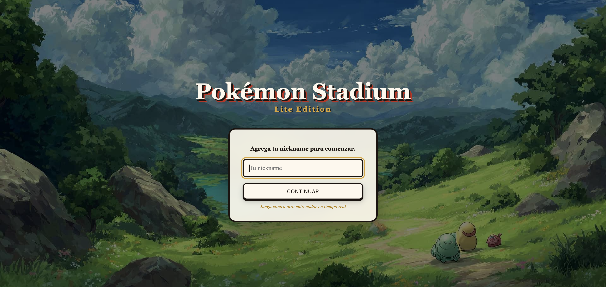

# albo pokemon backend by eddy

> A realtime multiplayer Pokemon battle backend. Two trainers enter, one champion leaves.

[](https://github.com/Eddyalexdev/albo-pokemon-backend/actions/workflows/ci.yml)
[](https://github.com/Eddyalexdev/albo-pokemon-backend/actions/workflows/deploy.yml)
[](https://opensource.org/licenses/MIT)



**Fastify + Socket.IO + MongoDB** - Clean Architecture - TypeScript ESM

---

## Overview

Pokemon Stadium Lite is a realtime multiplayer battle game where two trainers:

1. Join a lobby with a nickname
2. Receive 3 random Pokemon from the catalog
3. Confirm readiness
4. Battle in a turn-based, Speed-first duel

The backend orchestrates the entire game lifecycle -- lobby state, team assignment, battle flow, damage calculation, and realtime events -- over **Socket.IO** with full persistence in **MongoDB**.

---

## Features

| Feature | Detail |
|---------|--------|
| **Realtime battle** | Socket.IO -- no polling, event-driven |
| **Atomic turns** | Process-wide Mutex -- no race conditions |
| **Turn order** | Highest Speed stat goes first |
| **Damage formula** | `damage = max(1, attack - defense)` |
| **Auto-swap** | Defeated Pokemon are replaced automatically |
| **Persistence** | Full battle history in MongoDB |
| **Clean Architecture** | Domain -> Application -> Infrastructure layers |
| **Env validation** | Zod schema -- fails fast on bad config |

---

## Tech Stack

| Layer | Technology |
|-------|-----------|
| Runtime | Node.js 20+ |
| HTTP API | Fastify 5 |
| Realtime | Socket.IO 4 |
| Database | MongoDB + Mongoose 8 |
| Language | TypeScript ESM (NodeNext) |
| Validation | Zod |
| HTTP Client | Undici |
| Logging | Pino + pino-pretty |

---

## Architecture

See [docs/architecture.md](docs/architecture.md) for the full architecture documentation.

```
src/
├── domain/                    # Pure business logic -- zero framework deps
│   ├── entities/              # Lobby, Player, Pokemon, Battle
│   ├── value-objects/         # LobbyStatus
│   ├── repositories/          # LobbyRepository, BattleRepository (interfaces)
│   ├── services/              # PokemonCatalogService (interface)
│   └── errors/                # DomainError, NotFoundError, InvalidOperationError
│
├── application/              # Use cases -- orchestrate entities, no infra knowledge
│   ├── use-cases/            # JoinLobby, AssignPokemonTeam, MarkReady,
│   │                         # ProcessAttack, ResetLobby, GetCatalog
│   └── ports/                # BattleEventPublisher (interface)
│
├── infrastructure/           # Concrete adapters -- all framework code lives here
│   ├── http/                 # Fastify routes + centralized error handler
│   ├── sockets/              # Socket.IO publisher + event handlers
│   ├── repositories/          # MongoLobbyRepository, MongoBattleRepository
│   ├── services/              # HttpPokemonCatalogService (catalog adapter)
│   ├── database/             # Mongoose models + connection
│   ├── config/               # Zod env schema
│   └── container/             # Manual DI wiring
│
└── shared/                   # Cross-cutting utilities (Mutex)
```

**Dependency rule:** every import in `domain/` and `application/` points inward only. Infrastructure imports from application ports, never the reverse.

---

## Documentation

For detailed documentation, see:

- [docs/architecture.md](docs/architecture.md) -- Clean Architecture overview, layer responsibilities, design decisions
- [docs/entities.md](docs/entities.md) -- Domain entities with relationship diagrams, state transitions, persistence models
- [docs/flows.md](docs/flows.md) -- Complete game flow diagrams, Socket.IO events, attack processing flow
- [docs/business-logic.md](docs/business-logic.md) -- All business rules, formulas, validation, error handling

---

## Environment Variables

```bash
cp env.example .env
```

| Variable | Default | Description |
|----------|---------|-------------|
| `PORT` | `8080` | Server port |
| `HOST` | `0.0.0.0` | Server host |
| `MONGO_URI` | `mongodb://localhost:27017/pokemon_stadium` | MongoDB connection URI |
| `POKEMON_API_BASE_URL` | `https://pokemon-api-...` | External Pokemon catalog API |
| `CORS_ORIGIN` | *(none -- required)* | CORS allowed origin |
| `LOG_LEVEL` | `info` | Pino log level |

---

## Setup

```bash
# 1. Clone (or copy the project)
cd albo-pokemon-backend

# 2. Install dependencies
pnpm install

# 3. Configure environment
cp env.example .env

# 4. Start MongoDB (or update MONGO_URI to a cloud instance)
mongod --dbpath /usr/local/var/mongodb

# 5. Run in development mode
pnpm dev

# Server is live at http://0.0.0.0:8080
```

**Requirements:** Node.js 20+ - MongoDB running locally or a cloud URI

---

## HTTP API

| Method | Path | Description |
|--------|------|-------------|
| `GET` | `/health` | Health check -- `{ status: "ok" }` |
| `GET` | `/list` | List all Pokemon -- `[{id, name}]` |
| `GET` | `/list/:id` | Pokemon detail -- `{ pokemon }` |

---

## Socket.IO Events

### Client -> Server

| Event | Payload | Description |
|-------|---------|-------------|
| `join_lobby` | `{ nickname: string }` | Enter the lobby |
| `assign_pokemon` | -- | Request random 3-Pokemon team |
| `ready` | -- | Confirm team and readiness |
| `attack` | -- | Execute an attack on opponent |
| `reset_lobby` | -- | Reset lobby to initial state |

### Server -> Client

| Event | Payload | Triggered by |
|-------|---------|-------------|
| `lobby_status` | `LobbySnapshot` | Every state change |
| `battle_start` | `LobbySnapshot` | Both players ready |
| `turn_result` | `{ lobby, turn }` | After damage is applied |
| `pokemon_defeated` | `{ lobby, playerId, pokemonId }` | Defender HP -> 0 |
| `pokemon_entered` | `{ lobby, playerId, pokemonId }` | Opponent auto-swaps |
| `battle_end` | `{ lobby, winnerPlayerId }` | No Pokemon remaining |
| `error_event` | `{ code, message }` | Any server error |

---

## Battle Flow

```
  Player A --join_lobby--> Lobby (waiting)
  Player B --join_lobby--> Lobby (waiting)

  Player A --assign_pokemon--> 3 random Pokemon assigned
  Player B --assign_pokemon--> 3 random Pokemon (no overlap)

  Player A --ready--> +-- Both ready? --> battle_start (Battling)
  Player B --ready--> |     ^                   |
                       |    Speed               |
                       |  decides               |
                       | first turn            |
  Player A <--attack--+                   Turn loop:
  Player B --turn_result--> HP updated         |
  Player B <--attack--+                   damage + defeat
  Player A --turn_result-->                 check
                                              |
                                        No Pokemon left?
                                           +--->+
                                          battle_end
                                            + winner
```

---

## Project Structure

```
albo-pokemon-backend/
├── src/
│   ├── main.ts                      # Bootstrap entrypoint
│   ├── domain/
│   │   ├── entities/                # Core business models
│   │   ├── value-objects/           # LobbyStatus
│   │   ├── repositories/            # Abstract interfaces
│   │   ├── services/                # PokemonCatalogService port
│   │   └── errors/                  # Domain errors
│   ├── application/
│   │   ├── use-cases/               # All 6 use cases
│   │   └── ports/                   # BattleEventPublisher
│   ├── infrastructure/
│   │   ├── http/                    # Fastify routes
│   │   ├── sockets/                 # Socket.IO handlers
│   │   ├── repositories/            # MongoDB adapters
│   │   ├── services/                 # HTTP catalog adapter
│   │   ├── database/                 # Mongoose models
│   │   ├── config/                   # Zod env
│   │   └── container/                # DI wiring
│   └── shared/
│       ├── Mutex.ts                 # Atomic attack lock
│       └── socket.ts                # Socket.IO helpers
├── docs/                            # Documentation
│   ├── architecture.md
│   ├── entities.md
│   ├── flows.md
│   └── business-logic.md
├── package.json
├── tsconfig.json
├── env.example
└── README.md
```

---

## License

MIT -- Pokemon Stadium Lite backend project.
